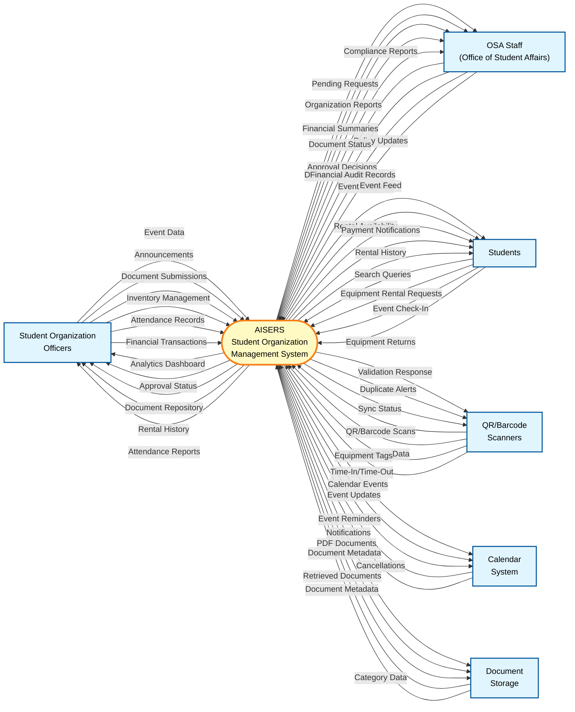

# AISERS Context Diagram

## Overview
This context diagram illustrates the AISERS (AI-powered Student Organization Management System) and its interactions with external entities. The system serves as a centralized platform for student organization management, event coordination, equipment rental, and administrative oversight.

## Context Diagram

## External Entities Description

### 1. Student Organization Officers
**Role**: Primary system users who manage day-to-day operations of their organizations.

**Inputs to System**:
- Event creation and scheduling requests
- Announcements for various audiences (All Students, Members Only, Officers)
- Document submissions (Proposals, Reports, Financial Statements, Resolutions)
- Equipment rental management (add/update inventory)
- Attendance tracking for organizational events
- Financial transaction records

**Outputs from System**:
- Real-time analytics dashboard (Financial Performance, Participation Trends, Inventory Utilization)
- Document approval status notifications
- Rental history and current inventory status
- Attendance reports and event participation data
- Quick action shortcuts for common tasks

### 2. OSA Staff (Office of Student Affairs)
**Role**: Administrative oversight and approval authority for student organizations.

**Inputs to System**:
- Approval/rejection decisions on event proposals, postings, and documents
- Document annotations (highlights, comments) during review
- Financial audit records and findings
- Policy updates and guidelines

**Outputs from System**:
- Pending approval requests (filtered by type, organization, status, date)
- Organization financial summaries and audit status
- Submitted documents with priority flagging
- Historical records of all organizational activities
- Compliance reports

### 3. Students
**Role**: General student body who engage with organizations and utilize services.

**Inputs to System**:
- Event search queries and filter preferences
- Equipment rental requests
- Event check-in confirmations (via QR/barcode)
- Equipment return confirmations
- Feedback on services

**Outputs from System**:
- Curated event feed (Today, Upcoming, Past)
- Interactive monthly calendar
- Search results for events and announcements
- Real-time equipment availability
- Rental payment notifications and history
- Unpaid debt alerts (blocks future rentals if applicable)

### 4. QR/Barcode Scanners
**Role**: Hardware/software integration for rapid data capture.

**Inputs to System**:
- Scanned student ID (barcode/QR) for event attendance
- Scanned equipment barcode/QR for rental checkout
- Time-in and time-out scans

**Outputs from System**:
- Validation confirmations (valid/invalid scan)
- Duplicate scan prevention alerts
- Offline mode sync status (queues scans locally, syncs when online)
- Attendance log confirmations

### 5. Calendar System
**Role**: External calendar integration for event management.

**Inputs to System**:
- Event reminders and notifications

**Outputs from System**:
- Automatically created calendar events from announcements
- Event updates and cancellations

### 6. Document Storage
**Role**: Persistent storage for organizational documents.

**Inputs to System**:
- Retrieve document requests (by ID, category, organization)

**Outputs from System**:
- PDF documents for storage (categorized by type and status)
- Document metadata (title, category, upload date, status)

---

## System Boundary

**Inside the System (AISERS Core Modules)**:
1. **Officer Dashboard Module** - Organization management interface
2. **OSA Dashboard Module** - Administrative oversight interface
3. **Student Dashboard Module** - Student engagement portal
4. **QR-Attendance System** - Event attendance tracking
5. **IGP Rental System** - Equipment rental management

**Outside the System**:
- All external entities listed above
- Physical hardware (scanners, student ID cards)
- Calendar platforms (Google Calendar, Outlook, etc.)
- File storage infrastructure (local server, cloud storage)
- Network infrastructure (internet connectivity, offline sync)

---

## Key Data Flows Summary

| From Entity | To Entity | Data Flow | Description |
|-------------|-----------|-----------|-------------|
| Officer | AISERS | Event Data | Event details, date/time, target audience |
| Officer | AISERS | Announcements | Text content, attachments, audience selection |
| Officer | AISERS | Documents | PDF files, category, metadata |
| AISERS | Officer | Analytics | Charts, financial data, participation metrics |
| OSA Staff | AISERS | Approvals | Approve/reject decisions with notes |
| AISERS | OSA Staff | Pending Requests | List of items needing review |
| Student | AISERS | Search Queries | Keywords, filters, date ranges |
| AISERS | Student | Event Information | Event details, location, time, registration |
| Scanner | AISERS | Scan Data | Barcode/QR code values, timestamps |
| AISERS | Scanner | Validation | Scan acceptance/rejection, status |
| AISERS | Calendar | Event Creation | Event title, description, date/time |
| AISERS | Storage | Document Upload | PDF files with metadata |
| Storage | AISERS | Document Retrieval | Requested PDF files |

---

## System Context Rules

### Authentication & Authorization
- All users must authenticate before accessing their respective dashboards
- Role-based access control (Officer, OSA Staff, Student)
- Officers can only manage their own organization's data
- OSA Staff has read access to all organizations

### Data Integrity
- All document submissions are timestamped and version-controlled
- Rental transactions record both checkout and return timestamps
- Attendance logs capture time-in and time-out for duration calculation
- Offline mode queues transactions and syncs when connectivity is restored

### Business Rules
- Students with unpaid rental debts are automatically blocked from new rentals
- Duplicate event check-ins are prevented by the system
- Document approval requires explicit action (no auto-approval)
- Events can trigger automatic calendar entries when configured

---

## Integration Points

### Real-Time Integrations
- **QR/Barcode Scanners**: Immediate validation and logging
- **Offline Queue Service**: Local storage during network outages

### Batch/Scheduled Integrations
- **Analytics Dashboard**: Refreshes metrics periodically
- **Financial Summaries**: Generated daily/weekly/monthly
- **Attendance Reports**: Exported on-demand or scheduled

### User-Initiated Integrations
- **Calendar Export**: Manual or automatic event creation
- **Excel Reports**: On-demand generation using SheetJS library
- **PDF Annotations**: Real-time during document review

---

## Notes
- The system operates as a **closed system** with defined boundaries—all external interactions are controlled through specified interfaces.
- **Offline capability** is a critical feature for the QR-Attendance and IGP Rental modules, ensuring uninterrupted service.
- The context diagram represents the **logical system boundary**, not physical deployment architecture.
