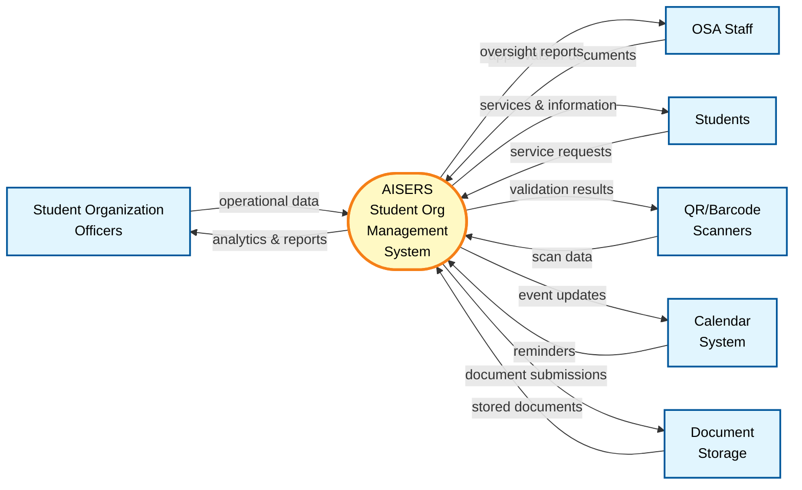
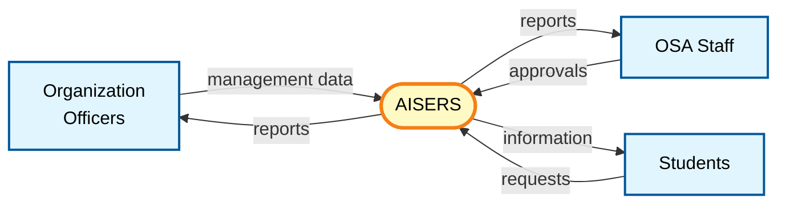

# AISERS DFD Level 0 Diagram

## Standard Data Flow Diagram - Level 0 (Context Diagram)

### Instructions
1. Copy the code below (between START and STOP markers)
2. Paste into https://mermaid.live to generate the image
3. Export as PNG or SVG

---

**START COPYING FROM HERE:**

**STOP COPYING HERE**

---

## Alternative Ultra-Simple Version (Most Generalized)

**START COPYING FROM HERE:**

**STOP COPYING HERE**

---

## Notes on Standard DFD Level 0 Notation

- **External Entities** (rectangles): People, organizations, or systems outside the system boundary
- **Process** (circle/oval): The single main process being modeled (AISERS)
- **Data Flows** (arrows): **Generalized, high-level** data movement (not detailed lists)
- **Level 0** means this is the highest-level view with simplified, abstracted data flows

## Key Difference from Context Diagram

**Context Diagram** (detailed):
- Shows every specific data flow separately
- Example: "Event Data", "Announcements", "Document Submissions", "Inventory Management", etc.
- More comprehensive but visually complex

**DFD Level 0** (simplified):
- Groups related flows into high-level categories
- Example: "operational data", "analytics & reports"
- Fewer arrows, more abstract terminology
- Follows traditional textbook DFD notation

---

## Coverage of System Features

This DFD Level 0 covers all 5 modules from system_features.md:

### **Officer Dashboard** → "operational data" / "analytics & reports"
Covers: Analytics Dashboard, Announcements, Event Integration, Document Workflow, Service Tracker, Events Calendar

### **OSA Dashboard** → "approvals & policies" / "oversight reports"
Covers: Financial Auditing, Approval System, Request Management, Document Workflow, Filtering

### **Student Dashboard** → "service requests" / "services & information"
Covers: Event Feed, Calendar, Search functionality

### **QR-Attendance System** → "scan data" / "validation results"
Covers: Fast Scanning, Time-In/Time-Out, Duplicate Prevention, Offline Mode, Export

### **IGP Rental System** → "scan data" / "validation results" + "service requests" / "services & information"
Covers: Inventory Catalog, Cart System, Barcode Checkout, Rental History, Automated Pricing, Unpaid Blocking, Offline Capability

### **Supporting Systems**
- **Calendar** → "reminders" / "event updates": Handles event integration and calendar synchronization
- **Storage** → "stored documents" / "document submissions": Manages PDF repository and submissions

## To Generate Image:
1. Visit https://mermaid.live
2. Copy code from between the START/STOP markers
3. Paste into the editor (the diagram will auto-render)
4. Click "Actions" → "Download PNG" or "Download SVG"

## Alternative Tools:
- Use VS Code with Mermaid Preview extension
- Use draw.io and manually recreate using DFD shapes
- Use any Mermaid renderer/converter online
