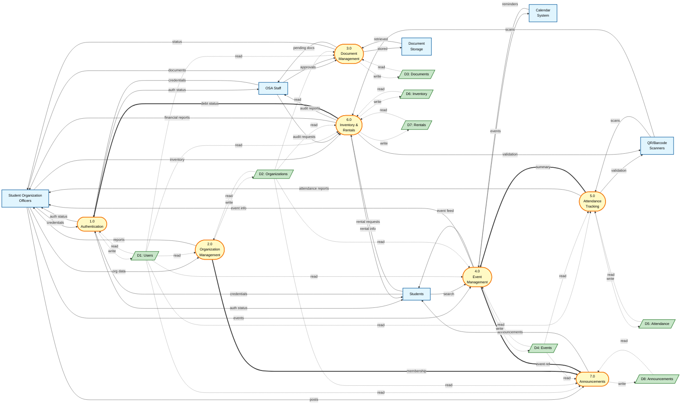

# AISERS DFD Level 1 Diagram (with Database)

## Data Flow Diagram - Level 1 (System Decomposition with Data Stores)

### Standard DFD Notation Used:
- **External Entities** (Rectangles)
- **Processes** (Circles/Ovals - numbered)
- **Data Stores** (Parallelograms/Open Rectangles)
- **Data Flows** (Arrows)

### Instructions
1. Copy the code below (between START and STOP markers)
2. Paste into https://mermaid.live to generate the image
3. Export as PNG or SVG

---

**START COPYING FROM HERE:**

**STOP COPYING HERE**

---

## Legend

### Symbols - Standard DFD Notation
- **Rectangles** (Blue): **External Entities** - users/systems outside AISERS
- **Circles/Ovals** (Yellow): **Processes** - internal sub-systems (numbered 1.0-7.0)
- **Parallelogram/Open Rectangle** (Green): **Data Stores** - database tables/files
- **Solid arrows** (→): **Data Flows** - flows between entities and processes
- **Dashed arrows** (-.->): **Data Flows** - flows between processes and data stores
- **Double arrows** (==>): **Data Flows** - inter-process communication

**Note:** This diagram follows traditional DFD notation (Yourdon/DeMarco style) where data stores are represented as open-ended rectangles, not database cylinders.

### Process Numbering
- **1.0** User Authentication & Management
- **2.0** Organization Management
- **3.0** Document Management
- **4.0** Event Management
- **5.0** Attendance Tracking
- **6.0** Inventory & Rental Management
- **7.0** Announcement Management

### Data Stores (Mapped to SQL Schema)
- **D1: Users** → `users` table (student_number, employee_number, email, role, etc.)
- **D2: Organizations** → `organizations` + `organization_members` tables
- **D3: Documents** → `documents` table (proposals, reports, financial statements)
- **D4: Events** → `events` table
- **D5: Attendance Logs** → `attendance_logs` table (time_in, time_out, duration)
- **D6: Inventory Items** → `inventory_items` table
- **D7: Rentals** → `rentals` + `rental_items` tables
- **D8: Announcements** → `announcements` table

---

## Process Descriptions

### 1.0 User Authentication & Management
**Inputs:** Login credentials from Officer, OSA, Student  
**Outputs:** Authentication status, user session data  
**Database:** Reads/writes `users` table  
**Functions:** 
- Validates login credentials (email/password)
- Manages user sessions
- Checks debt status for rental blocking
- Updates last login timestamp
- Differentiates between students (student_number) and OSA staff (employee_number)

### 2.0 Organization Management
**Inputs:** Organization data from Officer  
**Outputs:** Organization reports  
**Database:** Reads/writes `organizations`, `organization_members`  
**Functions:**
- Registers new organizations
- Manages memberships (member, officer, president, treasurer, secretary)
- Tracks organization status (active, probation, suspended)
- Provides analytics on membership

### 3.0 Document Management
**Inputs:** Document submissions from Officer, approvals from OSA  
**Outputs:** Document status to Officer, pending documents to OSA  
**Database:** Reads/writes `documents` table  
**External Storage:** Sends/retrieves PDF files  
**Functions:**
- Uploads and categorizes documents (proposal, activity_report, financial_statement)
- Tracks approval workflow (pending → ssc_review → osa_review → approved/rejected)
- Provides PDF viewing with annotations
- Records review notes and reviewer information

### 4.0 Event Management
**Inputs:** Event data from Officer, search queries from Student, reminders from Calendar  
**Outputs:** Event info to Officer, event feed to Student, calendar events to Calendar  
**Database:** Reads/writes `events` table  
**Functions:**
- Creates and schedules events
- Manages event details (location, date/time, type, max participants)
- Generates QR codes for events
- Publishes events to student dashboard
- Syncs with external calendar systems

### 5.0 Attendance Tracking
**Inputs:** QR/Barcode scans from Scanner  
**Outputs:** Validation response, attendance reports  
**Database:** Reads/writes `attendance_logs` table  
**Functions:**
- Records time-in/time-out for events
- Calculates attendance duration (duration_minutes)
- Prevents duplicate scans
- Supports offline mode with sync queue
- Exports attendance reports (Excel via SheetJS)

### 6.0 Inventory & Rental Management
**Inputs:** Inventory data from Officer, rental requests from Student, rental scans from Scanner, audit requests from OSA  
**Outputs:** Rental info, validation, financial reports, audit reports  
**Database:** Reads/writes `inventory_items`, `rentals`, `rental_items`  
**Functions:**
- Manages equipment catalog (uniforms, equipment, electronics)
- Processes rental transactions with barcode scanning
- Calculates costs based on hourly rates and duration
- Tracks rental status (active, returned, overdue, cancelled)
- Blocks rentals for users with unpaid debts
- Supports offline transactions with sync capability
- Updates inventory availability in real-time

### 7.0 Announcement Management
**Inputs:** Announcement data from Officer  
**Outputs:** Announcements to Students  
**Database:** Reads/writes `announcements` table  
**Functions:**
- Creates announcements with audience targeting (all_students, members_only, officers_only)
- Sets priority levels (low, normal, high, urgent)
- Links announcements to events (optional)
- Manages publication and expiration dates
- Filters announcements based on user membership

---

## Key Inter-Process Communications

### P2 → P7: Membership Data
Organization Management provides membership information to Announcement Management to filter announcements by audience (members_only, officers_only).

### P4 → P7: Event Reference
Event Management provides event references to Announcement Management for announcements linked to specific events (event_id foreign key).

### P5 → P4: Attendance Summary
Attendance Tracking sends attendance summaries back to Event Management for analytics and reporting.

### P6 → P1: Debt Status
Inventory & Rental Management updates user debt status in User Authentication & Management to block future rentals for users with unpaid debts.

---

## Database Schema Coverage

This DFD Level 1 covers all tables from your SQL Server schema:

| Data Store | SQL Tables | Key Fields |
|------------|-----------|------------|
| D1: Users | `users` | user_id, student_number, employee_number, email, role, course, year_level, has_unpaid_debt |
| D2: Organizations | `organizations`, `organization_members` | org_id, org_name, org_code, membership_id, role |
| D3: Documents | `documents` | document_id, title, document_type, status, file_path |
| D4: Events | `events` | event_id, event_name, event_date, start_time, end_time, qr_code_url |
| D5: Attendance Logs | `attendance_logs` | attendance_id, time_in, time_out, duration_minutes, scan_method |
| D6: Inventory Items | `inventory_items` | item_id, item_name, barcode, category, available_quantity, hourly_rate |
| D7: Rentals | `rentals`, `rental_items` | rental_id, rent_time, expected_return_time, actual_return_time, payment_status |
| D8: Announcements | `announcements` | announcement_id, title, content, audience_type, priority |

---

## To Generate Image:
1. Visit https://mermaid.live
2. Copy code from between the START/STOP markers
3. Paste into the editor (the diagram will auto-render)
4. Click "Actions" → "Download PNG" or "Download SVG"
5. Note: The diagram may be large - zoom out or use SVG for better quality
