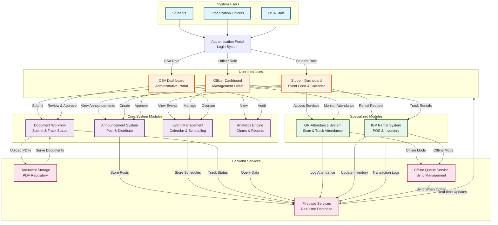

# Process Flow Diagram (PFD) - AISERS System

## System Overview
The AISERS (Academic Institution Student Engagement and Resource System) is a comprehensive web-based platform for managing student organization operations, event attendance, equipment rentals, and administrative workflows.

## High-Level Process Flow Diagram



## Component Description

### **System Users**
- **Students**: Access event information, announcements, and rental services
- **Organization Officers**: Manage events, documents, analytics, and organizational operations
- **OSA Staff**: Administrative oversight, approvals, and auditing

### **User Interfaces**
- **Student Dashboard**: Public-facing portal for event engagement and service access
- **Officer Dashboard**: Management portal with analytics, document submission, and service tracking
- **OSA Dashboard**: Administrative interface for approvals, auditing, and oversight

### **Core System Modules**
- **Announcement System**: Create, distribute, and manage organizational announcements
- **Event Management**: Schedule events, create calendar entries, and track participation
- **Document Workflow**: Submit proposals, reports, and resolutions with approval tracking
- **Analytics Engine**: Generate financial, participation, and inventory visualizations

### **Specialized Modules**
- **QR-Attendance System**: Barcode/QR scanning with time-in/out tracking and offline support
- **IGP Rental System**: Point-of-sale equipment rental with inventory management and offline capability

### **Backend Services**
- **Firebase Services**: Real-time database for all application data
- **Document Storage**: Centralized PDF repository for organizational documents
- **Offline Queue Service**: Local storage and synchronization for offline operations

## Data Flow Patterns

### **1. Student Engagement Flow**
```
Student → Login → Student Dashboard → View Events/Announcements
                                   → Access QR Attendance
                                   → Request Equipment Rental
```

### **2. Officer Management Flow**
```
Officer → Login → Officer Dashboard → Create Announcements → Firebase
                                   → Submit Documents → Storage
                                   → View Analytics → Query Firebase
                                   → Track Services → Specialized Systems
```

### **3. Administrative Oversight Flow**
```
OSA Staff → Login → OSA Dashboard → Review Documents → Update Status
                                  → Approve Announcements → Firebase
                                  → Audit Analytics → Query Firebase
```

### **4. Offline Synchronization Flow**
```
QR/IGP System → Offline Queue Service → Store Locally
                                      → Detect Connection
                                      → Sync to Firebase
```

## Key System Characteristics

### **Multi-Tenant Architecture**
- Role-based access control (Student, Officer, OSA)
- Dedicated dashboards per user type
- Shared backend services with permission layers

### **Real-Time Data**
- Firebase real-time database for instant updates
- Live synchronization across all connected clients
- Event-driven notifications

### **Offline Resilience**
- Local queue system for QR Attendance and IGP Rental
- Automatic synchronization when connection restored
- Uninterrupted service during network outages

### **Document Lifecycle**
- Upload → Review → Approval/Rejection → Archival
- Status tracking at every stage
- Integrated PDF viewer with annotation tools

---

## Notes
- This diagram emphasizes **component interaction** and **data movement**, not detailed logic flow
- Each module operates independently while sharing common backend services
- The system supports both online and offline operational modes for critical functions
